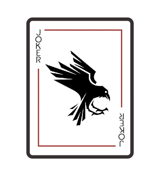

<p align="center"></p>

CrowJS is a JavaScript superset that has C++ style macros, which can provide convenience when programming by reducing repetitive code.


## Getting Started

Transpiling to JavaScript
```batch
> crow myfile.js
Transpiled to myfile.js
Process exited after 0.457053 seconds
```


## See more
[Documentation](documentation.md)
