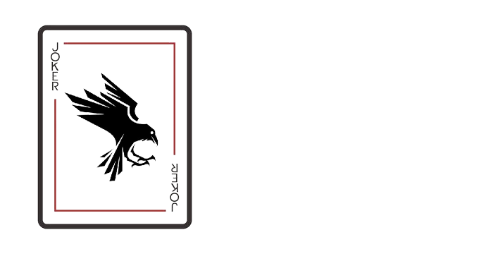

CrowJS is a JavaScript superset that has C++ style macros, seeking to provide convenience when programming by reducing repetitive code.


## Getting started
Write your code
```javascript
// myfile.js
#define MACRO console.log(__DATE__)

MACRO;
```

Transpile to JavaScript
```batch
> crow myfile.js
Transpiled to myfile.js
Process exited after 0.457053 seconds
```


## See more
- [Documentation](documentation.md)
- [Object-like macros](https://gcc.gnu.org/onlinedocs/cpp/Object-like-Macros.html)
- https://www.youtube.com/watch?v=uOiccQx20d8